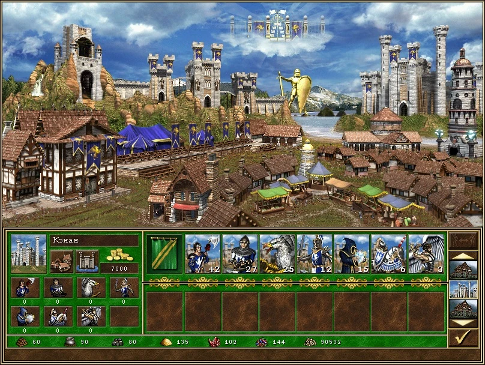
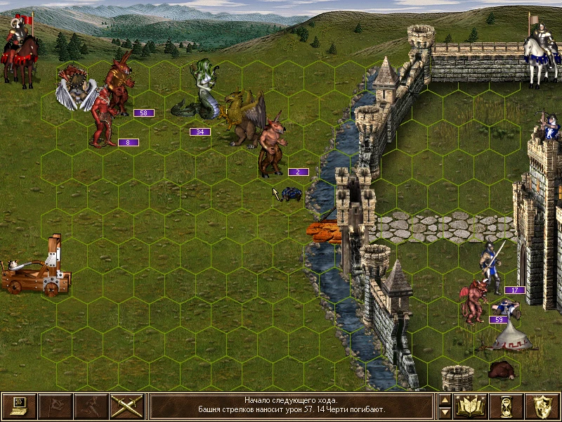
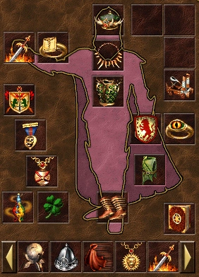
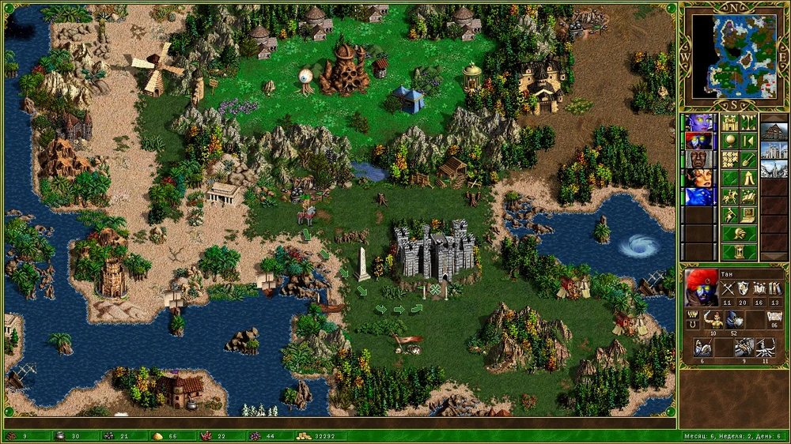
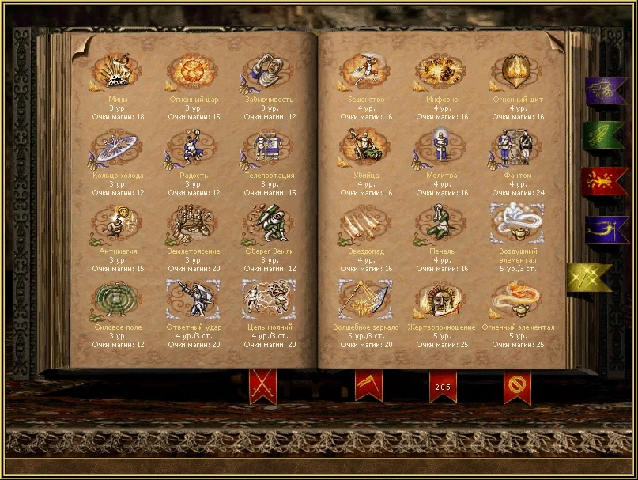
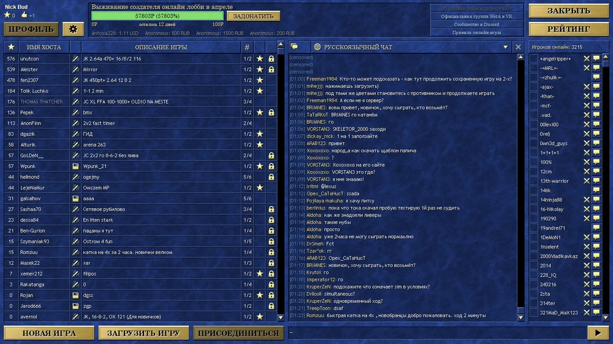
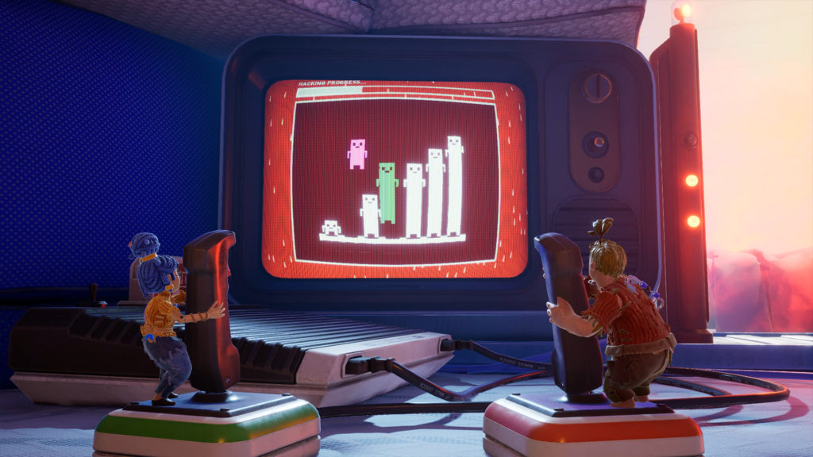
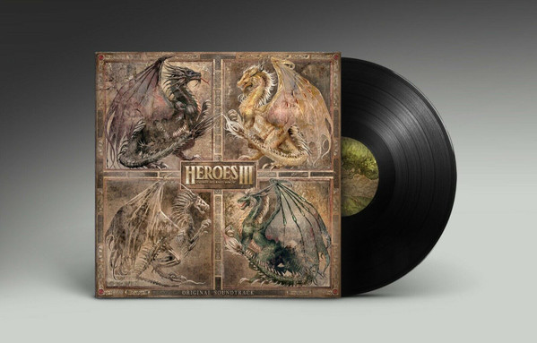

# Все мы выросли на

---

# Все мы выросли на

---

# Все мы выросли на

---

# Все мы выросли на

---

# Все мы выросли на

---

---

# 1999

---

---

---

# 9.2

---

---

---

---

---

---

---

---

---

---

# <!--fit-->✌️
